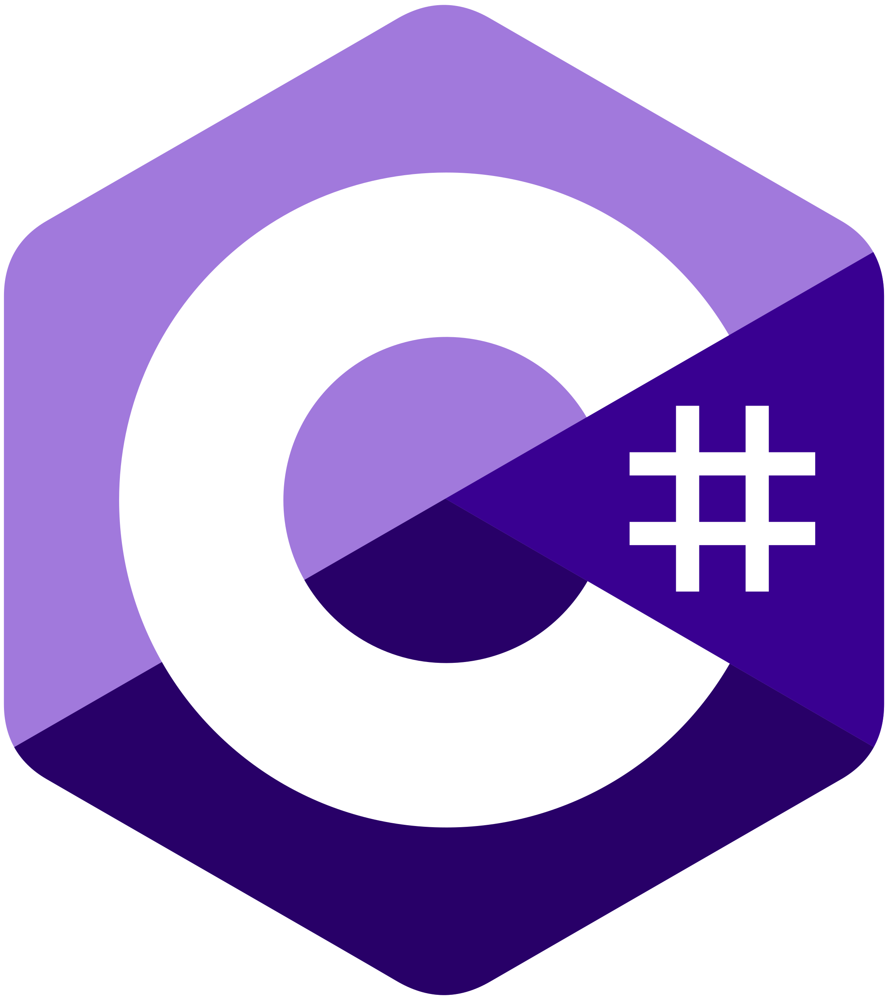
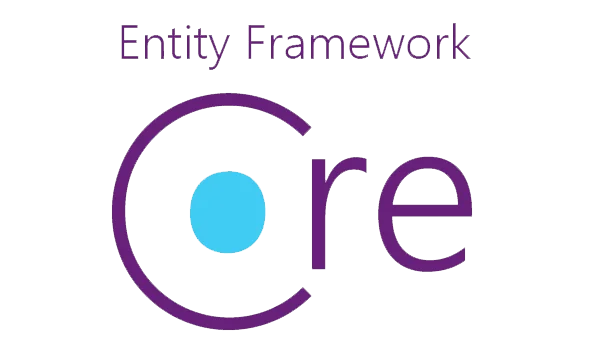

<h1 align="center">Hi👋, I'm Daesung Choi</h1>
<h2 align="center">I learn in order to become a better person than yesterday.</h3>

<h1>🗃️Portfolio</h2>

<h2>📂Document</h2>

[Portfolio](https://github.com/BIGSUNGG/BIGSUNGG/blob/main/Document/Portfolio.pdf)

<h2>📄Blog</h2>

[https://bigsungg.github.io](https://bigsungg.github.io)

---

<h2>✏️Personal Projects</h2>

- Unity [MMO RPG](https://github.com/BIGSUNGG/MMO_RPG)  
ㄴ `Unity 3D`, `C#`, `TCP/IP Socket`, `HTTP`,  `Wep Api`, `Protobuf`, `.NET EF Core`

- Unreal Engine [Mutlplayer FPS](https://github.com/BIGSUNGG/FPS)  
ㄴ `Unreal Engine5`, `C++`, `UE Networking`,`UE OnlineSubsystem`

- DirectX 2D [Copy Dungreed](https://github.com/BIGSUNGG/DirectX_2D)  
ㄴ `DirectX 11`, `C++`, `Win Api`, `FMOD`, `ImGui`

- Maui [File Manager](https://github.com/BIGSUNGG/File_Manager)  
ㄴ `.NET MAUI`, `.NET Blazor`, `C#`, `Python`, `HTML`, `CSS`, `IronPython`

---

<h2 align="left">💻Languages and Tools</h3>

<table align="center">
    <tr align="center">
        <td style="font-weight: bold; padding-right: 10px; vertical-align: center;">
            Language
        </td>
        <td>
            
            
                        
                        
        </td>
    </tr>
        <tr align="center">
        <td style="font-weight: bold; padding-right: 10px; vertical-align: center;">
            Game Engine
        </td>
        <td>
                        
                       
        </td>
    </tr>
        <tr align="center">
        <td style="font-weight: bold; padding-right: 10px; vertical-align: center;">
            Database
        </td>
        <td>
                        
                        
        </td>
    </tr >
        <tr align="center">
        <td style="font-weight: bold; padding-right: 10px; vertical-align: center;">
        Library
        </td>
        <td>  
                        
                        
                        
            ImGui
        </td>
    </tr>
    <tr align="center">
        <td style="font-weight: bold; padding-right: 10px; vertical-align: center; border: none;">
        Frontend
        </td>
        <td>
                        
                        
        </td>
    </tr>    
</table>

